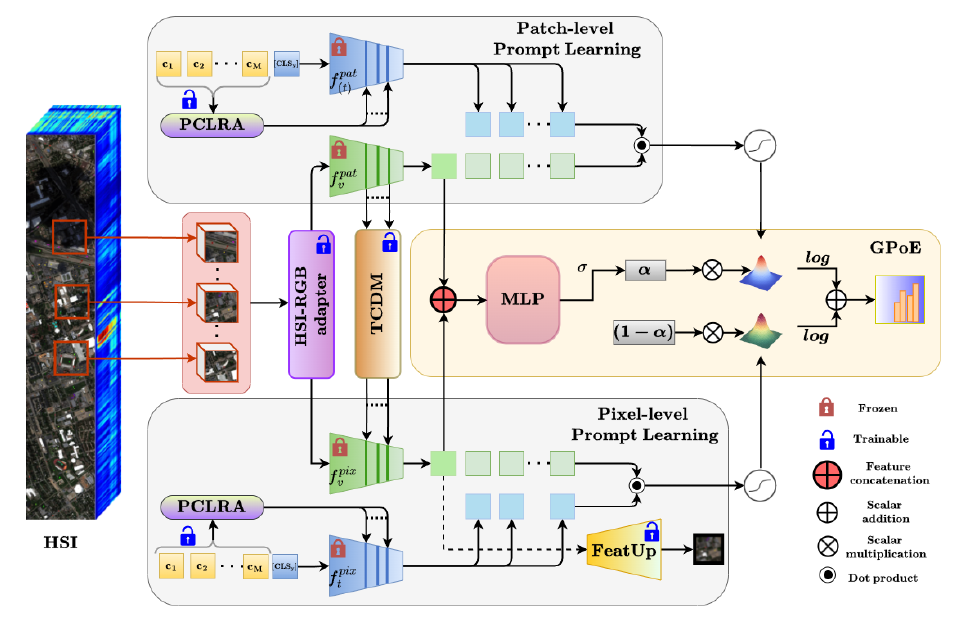

<div align="center">

# HyperPrompt

### From Patches to Pixels: Dual-Branch Prompt Learning for Hyperspectral Scene Generalization

### 🎉 Accepted at the BMVC 2026 Main Conference

[](https://www.python.org/)
[](https://pytorch.org/)
[](#datasets)
[](#supported-prompt-learners)

**Vivekananda Giri · Ushasi Chaudhuri · Biplab Banerjee**

Official PyTorch implementation of **HyperPrompt**, a patch-to-pixel framework for
source-only cross-scene hyperspectral image classification.

</div>

---

## Abstract

Cross-scene hyperspectral image classification is fundamentally challenged by spectral shift
underpinned by sensor variability, atmospheric conditions, and temporal changes. Domain
adaptation methods require target scene data, while language-guided generalization approaches
depend on handcrafted descriptions with full encoder fine-tuning, both fail to exploit the
scene-agnostic representations of large-scale pretrained vision-language models. Moreover,
no existing prompt learning method simultaneously exploits patch-level spectral-semantic
context and pixel-level spatial detail for cross-scene hyperspectral transfer. We propose
HyperPrompt, a dual-branch patch-to-pixel framework based on prompt adaptation of a frozen
vision–language encoder (CLIP) and a frozen segmentation encoder (SAM-2), unifying CLIP patch
tokens for global spectral-semantic grounding with frozen SAM-2 pixel tokens for fine-grained
spatial fidelity, enabling scene-agnostic generalization without any backbone end-to-end
fine-tuning. A Token-wise Cross-Scale Distillation Module (TCDM) directs semantic knowledge
flow from patch to pixel tokens; a Prompt-Conditioned Low-Rank Adapter (PCLRA) with
Hierarchical Orthogonality Regularization dynamically conditions each text encoder on its own
prompt semantics during training while enforcing complementary branch specialization; and a
Gated Product-of-Experts (GPoE) fusion demands joint expert confidence to sharpen predictions
under spectral shift. Extensive experiments on Houston, Pavia, and HyRank demonstrate that
HyperPrompt consistently outperforms state-of-the-art scene generalization and spectral
foundation model methods across all evaluation metrics, achieving average AA gains of +6.62%
and +10.59% over patch-only and pixel-only baselines on Houston, +10.07% and +7.56% on Pavia,
and +5.59% and +4.73% on HyRank, with particularly pronounced improvements under
class-imbalanced and low-source conditions.

## Architecture



*A shared HSI-RGB adapter feeds both branches. CLIP
ViT-B/16 extracts semantic patch tokens; SAM-2+FeatUp produces dense pixel tokens. TCDM
establishes directed semantic flow from patch to pixel tokens via layer-wise affine modulation.
Independent PCLRA-equipped text encoders receive low-rank updates generated from their own
prompt tokens during training; HOR enforces complementary specialization. GPoE fuses
dual-branch predictions in log-probability space for robust cross-scene classification.*

## Supported prompt learners

Every family is available at all three spatial scopes.

| Prompt learner | Patch branch | Pixel branch | HyperPrompt |
|---|:---:|:---:|:---:|
| CoOp | [`patch_coop`](configs/trainers/patch_coop.yaml) | [`pixel_coop`](configs/trainers/pixel_coop.yaml) | [`hyperprompt_coop`](configs/trainers/hyperprompt_coop.yaml) |
| KgCoOp | [`patch_kgcoop`](configs/trainers/patch_kgcoop.yaml) | [`pixel_kgcoop`](configs/trainers/pixel_kgcoop.yaml) | [`hyperprompt_kgcoop`](configs/trainers/hyperprompt_kgcoop.yaml) |
| MaPLe | [`patch_maple`](configs/trainers/patch_maple.yaml) | [`pixel_maple`](configs/trainers/pixel_maple.yaml) | [`hyperprompt_maple`](configs/trainers/hyperprompt_maple.yaml) |
| PromptSRC | [`patch_promptsrc`](configs/trainers/patch_promptsrc.yaml) | [`pixel_promptsrc`](configs/trainers/pixel_promptsrc.yaml) | [`hyperprompt_promptsrc`](configs/trainers/hyperprompt_promptsrc.yaml) |
| PromptKD | [`patch_promptkd`](configs/trainers/patch_promptkd.yaml) | [`pixel_promptkd`](configs/trainers/pixel_promptkd.yaml) | [`hyperprompt_promptkd`](configs/trainers/hyperprompt_promptkd.yaml) |
| MMRL | [`patch_mmrl`](configs/trainers/patch_mmrl.yaml) | [`pixel_mmrl`](configs/trainers/pixel_mmrl.yaml) | [`hyperprompt_mmrl`](configs/trainers/hyperprompt_mmrl.yaml) |

## Installation

HyperPrompt uses Python 3.12. On Ubuntu/Debian, install the venv support package once if
`python3.12 -m venv` reports that `ensurepip` is unavailable:

```bash
sudo apt update
sudo apt install python3.12-venv
```

Then create an isolated environment:

```bash
git clone https://github.com/vivekananda05/HyperPrompt.git
cd HyperPrompt

python3.12 -m venv .venv
source .venv/bin/activate
python -m pip install --upgrade pip
```

For GPU training, select the command matching your CUDA runtime from the
[official PyTorch installer](https://pytorch.org/get-started/locally/). Then complete the
environment and verify the two required backbone classes:

```bash
python -m pip install -r requirements.txt
python -c "import torch, transformers; from transformers import CLIPModel, Sam2Model; print(f'PyTorch {torch.__version__} | Transformers {transformers.__version__} | CUDA {torch.cuda.is_available()}')"
```

The alternative SAPA and CARAFE upsamplers are optional and require their upstream packages;
the default `resize_conv` setup needs no additional compiled extensions.

## Download model files

The large backbone files are intentionally kept out of Git. After installation, run the
following commands from the repository root; the destination directories match the default
YAML configuration exactly.

```bash
mkdir -p models/weights

# CLIP ViT-B/16
hf download openai/clip-vit-base-patch16 \
  --local-dir models/clip-vit-base-patch16

# SAM 2.1 Hiera Small
hf download facebook/sam2.1-hiera-small \
  --local-dir models/sam2.1-hiera-small
```

## Datasets

HyperPrompt follows strict source-only training: target-scene labels are used only for final
evaluation.

> **Data and model availability.** Datasets are not distributed with this repository. The
> Houston, Pavia, and HyRank cross-scene datasets can be downloaded from
> [Data-CSHSI](https://github.com/YuxiangZhang-BIT/Data-CSHSI). CLIP and SAM files are not
> committed to this repository; use the download commands above and follow each provider's
> license and terms of use. The small reconstruction checkpoint is bundled for reproducibility.

| Benchmark | Source scene | Target scene | Classes |
|---|---|---|:---:|
| Houston | Houston 2013 | Houston 2018 | 7 |
| Pavia | Pavia University | Pavia Centre | 7 |
| HyRank | Dioni | Loukia | 12 |

Dataset paths, class names, palettes, patch size, and source/target assignments live in
[`configs/datasets`](configs/datasets).

## Training and evaluation

The launcher trains on the source scene and immediately evaluates the saved checkpoint on the
target scene:

```bash
bash scripts/run.sh houston hyperprompt_promptsrc 42
```

Its arguments are:

```text
bash scripts/run.sh <dataset> <model> <seed>
```

Valid dataset keys are `houston`, `pavia`, and `hyrank`. To run all 18 models sequentially,
choose a dataset and use:

```bash
models=(
  patch_coop       pixel_coop       hyperprompt_coop
  patch_kgcoop     pixel_kgcoop     hyperprompt_kgcoop
  patch_maple      pixel_maple      hyperprompt_maple
  patch_promptsrc  pixel_promptsrc  hyperprompt_promptsrc
  patch_promptkd   pixel_promptkd   hyperprompt_promptkd
  patch_mmrl       pixel_mmrl       hyperprompt_mmrl
)

for model in "${models[@]}"; do
  bash scripts/run.sh houston "$model" 42
done
```

## Reproducibility notes

- Use the same seed when comparing models.
- Keep source/target assignments unchanged when comparing with the paper.
- HyperPrompt defaults to PCLRA rank `8`, prompt dimension `64`, TCDM depth `4`, and
  `lambda_hor = 1.0`.
- Dataset, downloaded backbone, and generated checkpoint directories are ignored by Git; the
  reconstruction upsampler weight is the only bundled model file.
- Training logs are written under `outputs/<Dataset>/logs/`.

## Citation

If HyperPrompt is useful in your research, please cite the paper.

```bibtex
@inproceedings{giri2026hyperprompt,
  title     = {From Patches to Pixels: Dual-Branch Prompt Learning
               for Hyperspectral Scene Generalization},
  author    = {Giri, Vivekananda and Chaudhuri, Ushasi and Banerjee, Biplab},
  booktitle = {Proceedings of the British Machine Vision Conference (BMVC)},
  year      = {2026}
}
```

## Acknowledgments

This project builds on ideas and open-source components from
[CLIP](https://github.com/openai/CLIP),
[SAM-2](https://github.com/facebookresearch/sam2),
[FeatUp](https://github.com/mhamilton723/FeatUp),
[CoOp](https://github.com/KaiyangZhou/CoOp),
[MaPLe](https://github.com/muzairkhattak/multimodal-prompt-learning),
[PromptSRC](https://github.com/muzairkhattak/PromptSRC),
[PromptKD](https://github.com/zhengli97/PromptKD), and
[MMRL](https://github.com/yunncheng/MMRL). We thank their authors for making their research
and implementations publicly available.

## Contact

For questions, reproducibility issues, or corrections, please open a GitHub issue.

---

<div align="center">
  <sub>Patch semantics. Pixel precision. One prompt-learning framework.</sub>
</div>
