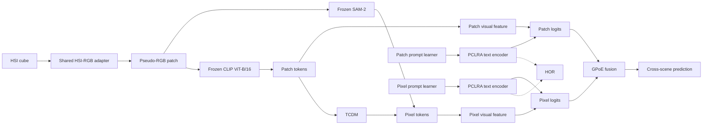

<div align="center">

# HyperPrompt

### From Patches to Pixels: Dual-Branch Prompt Learning for Hyperspectral Scene Generalization

[](https://www.python.org/)
[](https://pytorch.org/)
[](#datasets)
[](#supported-prompt-learners)

**Vivekananda Giri · Ushasi Chaudhuri · Biplab Banerjee**

Official PyTorch implementation of **HyperPrompt**, a patch-to-pixel framework for
source-only cross-scene hyperspectral image classification.

</div>

---

## Why HyperPrompt?

Hyperspectral scenes change across sensors, locations, atmospheric conditions, and
acquisition times. A classifier trained on one scene can therefore degrade sharply on
another—even when the semantic classes remain the same.

HyperPrompt combines two complementary views of an HSI patch:

- **CLIP patch tokens** provide global spectral-semantic context.
- **SAM-2 pixel tokens** preserve fine-grained spatial structure.
- **TCDM** transfers semantic knowledge from patch tokens to pixel tokens.
- **PCLRA** adapts both text encoders using their own learned prompt geometry.
- **HOR** discourages the two text branches from collapsing to redundant solutions.
- **GPoE** fuses branch predictions only when both experts assign strong confidence.

CLIP and SAM-2 remain frozen. Learning is concentrated in the spectral adapter, prompts,
TCDM, PCLRA, projection/reconstruction layers, and fusion gate.

## Method at a glance



The paper objective is implemented as

```text
loss_total = loss_ce + lambda_recon * loss_recon + lambda_reg * loss_hor
```

Method-specific objectives from the underlying prompt learner—such as PromptSRC
consistency or PromptKD distillation—are retained alongside the HyperPrompt terms.

## Highlights

- Unified **patch-only**, **pixel-only**, and **HyperPrompt** comparisons.
- Six prompt-learning families under one source-to-target evaluation protocol.
- Frozen CLIP ViT-B/16 and SAM-2 backbones for parameter-efficient adaptation.
- Paper-aligned implementations of **TCDM**, **PCLRA**, **HOR**, and **GPoE**.
- Configuration-driven experiments across Houston, Pavia, and HyRank.
- Reproducible artifact names keyed by dataset, model, seed, and run ID.

## Supported prompt learners

Every family is available at all three spatial scopes.

| Prompt learner | Patch branch | Pixel branch | HyperPrompt |
|---|:---:|:---:|:---:|
| CoOp | [`patch_coop`](configs/trainers/patch_coop.yaml) | [`pixel_coop`](configs/trainers/pixel_coop.yaml) | [`hyperprompt_coop`](configs/trainers/hyperprompt_coop.yaml) |
| KgCoOp | [`patch_kgcoop`](configs/trainers/patch_kgcoop.yaml) | [`pixel_kgcoop`](configs/trainers/pixel_kgcoop.yaml) | [`hyperprompt_kgcoop`](configs/trainers/hyperprompt_kgcoop.yaml) |
| MaPLe | [`patch_maple`](configs/trainers/patch_maple.yaml) | [`pixel_maple`](configs/trainers/pixel_maple.yaml) | [`hyperprompt_maple`](configs/trainers/hyperprompt_maple.yaml) |
| PromptSRC | [`patch_promptsrc`](configs/trainers/patch_promptsrc.yaml) | [`pixel_promptsrc`](configs/trainers/pixel_promptsrc.yaml) | [`hyperprompt_promptsrc`](configs/trainers/hyperprompt_promptsrc.yaml) |
| PromptKD | [`patch_promptkd`](configs/trainers/patch_promptkd.yaml) | [`pixel_promptkd`](configs/trainers/pixel_promptkd.yaml) | [`hyperprompt_promptkd`](configs/trainers/hyperprompt_promptkd.yaml) |
| MMRL | [`patch_mmrl`](configs/trainers/patch_mmrl.yaml) | [`pixel_mmrl`](configs/trainers/pixel_mmrl.yaml) | [`hyperprompt_mmrl`](configs/trainers/hyperprompt_mmrl.yaml) |

## Installation

HyperPrompt uses Python 3.12. On Ubuntu/Debian, install the venv support package once if
`python3.12 -m venv` reports that `ensurepip` is unavailable:

```bash
sudo apt update
sudo apt install python3.12-venv
```

Then create an isolated environment:

```bash
git clone https://github.com/vivekananda05/HyperPrompt.git
cd HyperPrompt

python3.12 -m venv .venv
source .venv/bin/activate
python -m pip install --upgrade pip
```

Install PyTorch before the remaining packages. For CPU-only execution:

```bash
python -m pip install torch --index-url https://download.pytorch.org/whl/cpu
```

For GPU training, select the command matching your CUDA runtime from the
[official PyTorch installer](https://pytorch.org/get-started/locally/). Then complete the
environment and verify the two required backbone classes:

```bash
python -m pip install -r requirements.txt
python -c "import torch, transformers; from transformers import CLIPModel, Sam2Model; print(f'PyTorch {torch.__version__} | Transformers {transformers.__version__} | CUDA {torch.cuda.is_available()}')"
```

CPU execution is supported, but dual-backbone training is computationally expensive. The
alternative SAPA and CARAFE upsamplers are optional and require their upstream packages;
the default `resize_conv` setup needs no additional compiled extensions.

## Download model files

The large backbone files are intentionally kept out of Git. After installation, run the
following commands from the repository root; the destination directories match the default
YAML configuration exactly.

```bash
mkdir -p models/weights

# CLIP ViT-B/16
hf download openai/clip-vit-base-patch16 \
  --local-dir models/clip-vit-base-patch16

# SAM 2.1 Hiera Small
hf download facebook/sam2.1-hiera-small \
  --local-dir models/sam2.1-hiera-small
```

These commands use the `hf` command installed by `huggingface-hub`. The 5.5 MB SimFeatUp
reconstruction checkpoint is already included at
[`models/weights/xclip_jbu_one_million_aid.ckpt`](models/weights/xclip_jbu_one_million_aid.ckpt),
with attribution to the
[SegEarth-OV model repository](https://huggingface.co/BiliSakura/SegEarth-OV). If a model is
stored elsewhere, update the corresponding `path` or `weights` entry in
[`configs/models`](configs/models).

## Datasets

HyperPrompt follows strict source-only training: target-scene labels are used only for final
evaluation.

> **Data and model availability.** Datasets are not distributed with this repository. The
> Houston, Pavia, and HyRank cross-scene datasets can be downloaded from
> [Data-CSHSI](https://github.com/YuxiangZhang-BIT/Data-CSHSI). CLIP and SAM files are not
> committed to this repository; use the download commands above and follow each provider's
> license and terms of use. The small reconstruction checkpoint is bundled for reproducibility.

| Benchmark | Source scene | Target scene | Classes |
|---|---|---|:---:|
| Houston | Houston 2013 | Houston 2018 | 7 |
| Pavia | Pavia University | Pavia Centre | 7 |
| HyRank | Dioni | Loukia | 12 |

```text
data/
├── Houston/
│   ├── Houston13.mat
│   ├── Houston13_7gt.mat
│   ├── Houston18.mat
│   └── Houston18_7gt.mat
├── Pavia/
│   ├── paviaU.mat
│   ├── paviaU_7gt.mat
│   ├── paviaC.mat
│   └── paviaC_7gt.mat
└── HyRank/
    ├── Dioni.mat
    ├── Dioni_gt_out68.mat
    ├── Loukia.mat
    └── Loukia_gt_out68.mat
```

Dataset paths, class names, palettes, patch size, and source/target assignments live in
[`configs/datasets`](configs/datasets).

## Training

Train PromptSRC + HyperPrompt on Houston:

```bash
python train.py \
  --dataset houston \
  --model hyperprompt_promptsrc \
  --seed 42 \
  --run-id paper_seed42
```

The command pattern works for every entry in the model matrix. Valid dataset keys are
`houston`, `pavia`, and `hyrank`.

For example, train the MaPLe patch-only baseline with:

```bash
python train.py --dataset pavia --model patch_maple --seed 42 --run-id patch_baseline
```

## Evaluation

```bash
python test.py \
  --dataset houston \
  --model hyperprompt_promptsrc \
  --seed 42 \
  --run-id paper_seed42
```

Dataset, model, seed, and run ID must match the training command because they determine the
checkpoint filename.

To train and immediately evaluate:

```bash
bash scripts/run.sh houston hyperprompt_promptsrc 42 paper_seed42
```

The wrapper signature is:

```text
bash scripts/run.sh <dataset> <model> <seed> <run_id>
```

## Repository map

```text
HyperPrompt/
├── configs/                 # Dataset, backbone, and trainer configurations
├── models/weights/          # Bundled reconstruction checkpoint
├── scripts/run.sh           # Portable train-then-test launcher
├── trainers/
│   ├── models/              # Patch, pixel, and HyperPrompt models
│   ├── losses/              # Matching objectives
│   ├── pclra_utils.py       # PCLRA and HOR
│   ├── sam_backbone.py      # SAM-2 with TCDM
│   └── hsi_rgb_adapter.py   # Shared spectral projection
├── config_loader.py         # Configuration composition and CLI
├── dataset.py               # Cross-scene HSI data pipeline
├── train.py                 # Training entry point
└── test.py                  # Target-scene evaluation entry point
```

## Reproducibility notes

- Use the same seed and run ID for training and evaluation.
- Keep source/target assignments unchanged when comparing with the paper.
- HyperPrompt defaults to PCLRA rank `8`, prompt dimension `64`, TCDM depth `4`, and
  `lambda_hor = 1.0`.
- Dataset, downloaded backbone, and generated checkpoint directories are ignored by Git; the
  reconstruction upsampler weight is the only bundled model file.
- Training logs are written under `outputs/<Dataset>/logs/`.

## Citation

If HyperPrompt is useful in your research, please cite the paper. Venue and publication
metadata will be updated after publication.

```bibtex
@article{giri2026hyperprompt,
  title   = {From Patches to Pixels: Dual-Branch Prompt Learning for Hyperspectral Scene Generalization},
  author  = {Giri, Vivekananda and Chaudhuri, Ushasi and Banerjee, Biplab},
  year    = {2026},
  note    = {Manuscript}
}
```

## Acknowledgments

This project builds on ideas and open-source components from
[CLIP](https://github.com/openai/CLIP),
[SAM-2](https://github.com/facebookresearch/sam2),
[FeatUp](https://github.com/mhamilton723/FeatUp),
[CoOp](https://github.com/KaiyangZhou/CoOp),
[MaPLe](https://github.com/muzairkhattak/multimodal-prompt-learning),
[PromptSRC](https://github.com/muzairkhattak/PromptSRC), and
[PromptKD](https://github.com/zhengli97/PromptKD). We thank their authors for making their
research and implementations publicly available.

## Contact

For questions, reproducibility issues, or corrections, please open a GitHub issue.

---

<div align="center">
  <sub>Patch semantics. Pixel precision. One prompt-learning framework.</sub>
</div>
